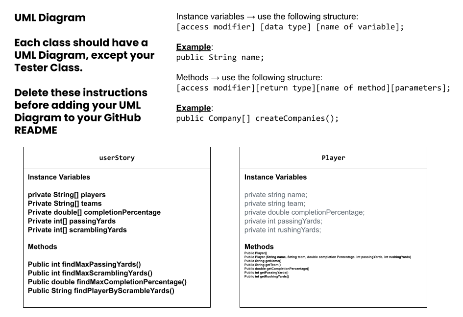

# Unit 2 - Data for Social Good Project

## Introduction

Software engineers develop programs to work with data and provide information to a user. Each user has different needs based on the information they are looking for from data. Your goal is to create a data analysis program for your user that stores and analyzes data to provide the information they need.

## Requirements

Use your knowledge of object-oriented programming, one-dimensional (1D) arrays, and algorithms to create your data analysis program:
- **Write a class** – Write a class to represent your user or business and store and analyze their data with no-argument and parameterized constructors.
- **Create at least two 1D arrays** – Create at least two 1D arrays to store the data that your user needs information about.
- **Write a method** – Write a method that finds or manipulates the elements in a 1D array to provide the information your user needs.
- **Implement a toString() method** – Write a toString() method that returns general information about the data (for example, number of values in the dataset).
- **Document your code** – Use comments to explain the purpose of the methods and code segments and note any preconditions and postconditions.

## User Story 

Include your User Story you analyzed for your project here. Your User Story should have the following format: 

> As a sports enthusiast of the NFL, we want to analyze football data, so we can determine who was the best quarterback in 2023.    
> I want to determine what quarterback had the most passing yards, scrambling yards, and highest completion percentage in the whole season.   
> so that I can show the user who was the best quarterback in the 2023 NFL season based on different statistics. .

## Dataset 

Include a hyperlink to the source of your dataset used for this project. Additionally, provide a short description of each column used from the dataset, and the data type. 

Example: 

Dataset: https://docs.google.com/spreadsheets/d/1jAQyQnfQs1f0NMfI29qctQPpMdC1tA_b5wZLsvYK6JA/edit?gid=0#gid=0

- **Player Name** (String) - Name of the player. 
- **Team** (String) - Name of the team
- **Plays** (int) - Amount of plays ran
- **Comp %** (double) - Total completion percentage of the season
- **Passing Yards** (int) - Amount of total passing yards in the season
- **Scrambling Yards** (int) - Amount of total scrambling yards in the season

## UML Diagram 

 

## Description 

My data for social good project is based on NFL data in the 2023 season. First, we used our user story to begin and brainstorm our idea for our project. We found a dataset and began to create txt files on our code.org for the data we were going to use. Our project addressed the users goals because the questions we aimed to answer were what quarterback in the 2023 season had the most passing yards, most scrambling yards, and highest completion percentage. All of these questions were answered using our dataset. 
